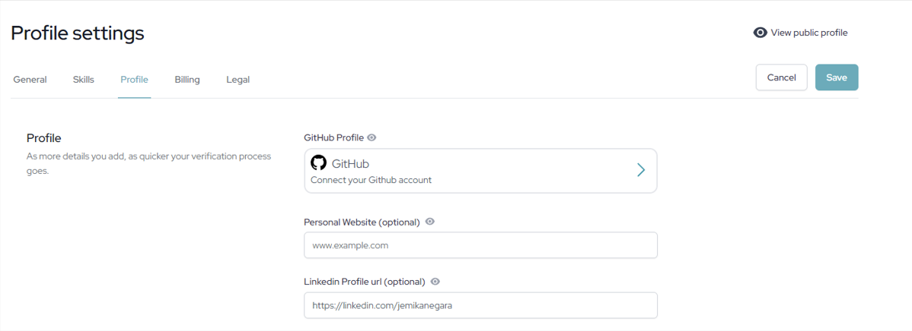

# Github Integration

## How to Set Up Github Integration in Tasksource

1. Begin by navigating to the Tasksource profile settings page at this URL: [https://www.app.tasksource.io/profile/settings](https://www.app.tasksource.io/profile/settings).

2. Go to the "Profile" tab. Here, you will find the "Connect Github Account" button. Click on it, and you will be redirected to the Github authorization page.

3. On the Github authorization page, you will be asked to grant some permissions to Tasksource. You can also grant access to an organization if you wish to connect Tasksource projects with Github organization repositories in the future. After clicking the "Authorize" button, you will be redirected back to Tasksource. You are now ready to connect Tasksource projects with your Github repositories.

Watch a video of Jemika connecting a Github account here:
[Watch Video](media/github-add-profile.webm)

## Connect Your First Project

1. Create a new project at [https://www.app.tasksource.io/projects](https://www.app.tasksource.io/projects), fill in the general project information, and then navigate to the "Integrations" tab.

2. If your Github account is not yet connected to Tasksource, you will see a "Connect Github Account" button with the same functionality as the button in the profile settings. Click on it and follow the same steps as in the "How to Set Up Github Integration in Tasksource" section.

3. If your Github account is already connected, a list of the repositories you have recently worked on will be displayed. There is also a filter feature to help you find the repository you want to connect. On the left side, select the repository owner, which can be a Github user or organization. On the right side, input the repository name. After you have located the repository, click "Select".

  ``Please note: If you cannot find the organization you want to connect, it means you did not grant access to the organization. To resolve this, you need to remove the Github integration and reconnect it, granting the correct permissions.``

4. Next, select the development branch you wish to connect.

Congratulations! You've successfully completed the setup for Github integration in Tasksource. You can now enjoy the following benefits for tasks under the connected project:

1. If the assigned developer has their Github account connected to Tasksource, Tasksource will automatically grant them access to the connected repository.

2. You can track commit progress in the tasks under the connected project.

3. When a task is closed, Tasksource will automatically open a Pull Request and revoke the developer's access to the repository.

Watch a video of Jemika connecting a Github repository here:
[Watch Video](media/github-add-project.webm)

## Remove GitHub Connection

1. Navigate to the TaskSource profile settings page at this URL: [https://www.app.tasksource.io/profile/settings](https://www.app.tasksource.io/profile/settings).

2. Go to the "Integrations" tab. If your GitHub account is already connected, there will be an "X" icon in the top right corner of the GitHub Profile button. Click on it, and a warning message will be displayed.

3. Click "Yes, remove connection" to proceed.

## Security

At our organization, we place the utmost importance on security and privacy. Our stringent security policy reflects our commitment to safeguarding your information and maintaining your trust. Below are some of the robust security measures we have implemented:

- With regards to the commit list, we guarantee that none of it is stored on Tasksource servers. All commits are fetched using the user's own Github token, so only Tasksource users who have a Github account with access to the repository can see them.

- Our protocols strictly align with Github's security guidelines, demonstrating our commitment to not only adhere to but also exceed industry standards.

By implementing these rigorous security measures, we strive to provide a safe and secure environment for your data, ensuring peace of mind and a reliable experience.
