# Jira Integration


## How to setup Jira integration in tasksource

1. Begin by navigating to the tasksource company creation page at this URL: https://www.app.tasksource.io/companies. Here, proceed to establish a new company.

2. Once done, move to the "Integrations" tab. Here, key in your Jira URL and confirm your changes by clicking on the "Save" button.

3. The next step involves informing Jira about the specific tasksource project the issue pertains to. This can be achieved by creating a Jira label that's linked to your tasksource project.

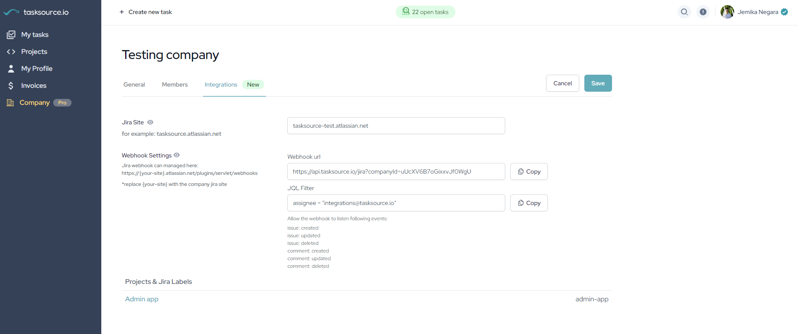

4. To do this, navigate to your tasksource project, click on the "Integrations" tab, and then create a new Jira Label.

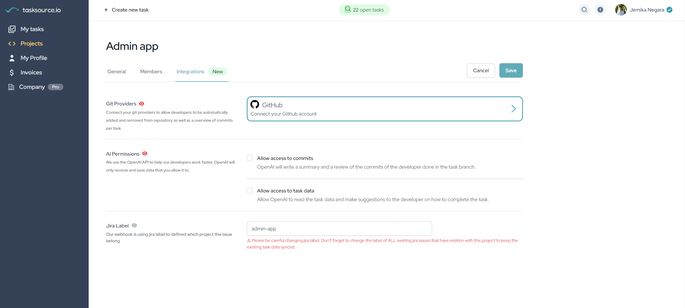


## Now, let's shift our attention to Jira's setup:

1. Start by copying the tasksource webhook. You can find this under the "Integrations" section at https://www.app.tasksource.io/companies.

2. Next, click on the "Settings" option located at the top right corner of your screen. From the subsequent dropdown menu, select "System," followed by "Webhooks."

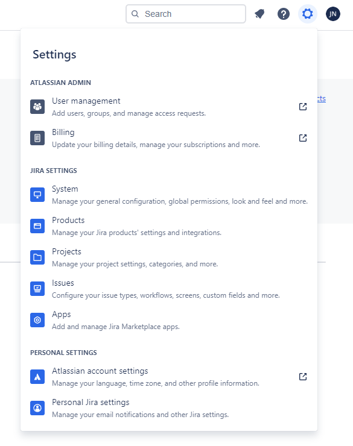
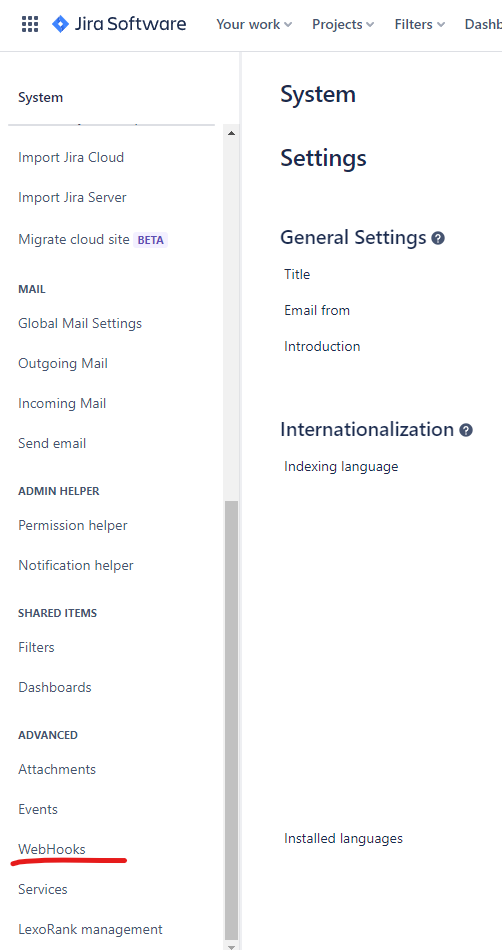

3. Proceed to add a new Webhook and paste the previously copied tasksource webhook URL into the relevant field.

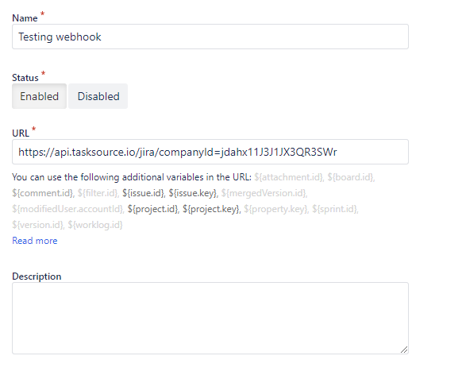

4. Add this into the JQL query field, so only issues that assigned to integrations@tasksource.io will trigger the webhook

````jql
assignee = "integrations@tasksource.io"
````

Example:

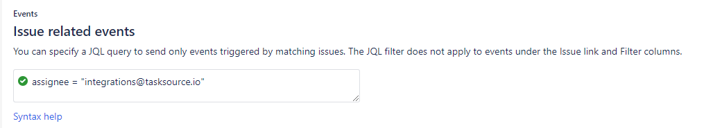

5. In the "Events" section, check the boxes for the following options: "Issue created, updated, and deleted" & "Comments created, updated, and deleted"

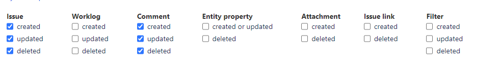

6. Once you have filled in all the necessary details like image below, click on the "Create" button to confirm your new webhook.

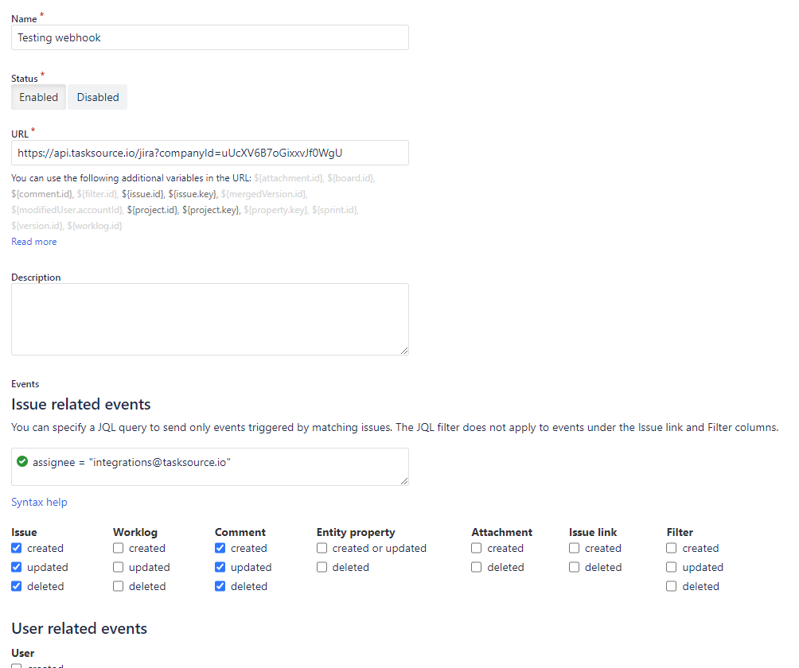

7. To add necessary permissions, include integrations@tasksource.io as a regular project member in your Jira project.

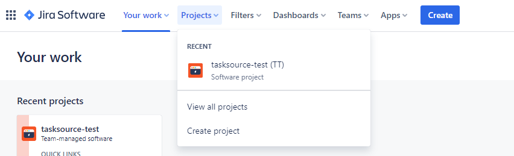
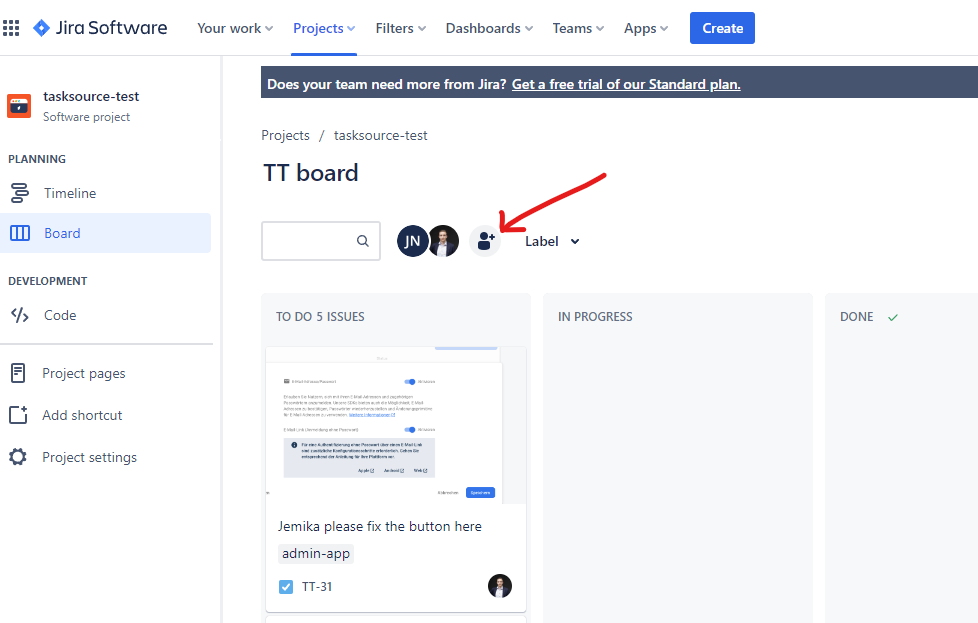


Congratulations! You've successfully completed the setup for Jira integration in tasksource. Now, you can seamlessly manage your tasks across both platforms. 

Watch a Video of Jemika setting up the jira webhook here:

[Part 1: Setup webhook](media/jira-webhook-setup-full.webm)

[Part 2: Invite tasksource integration account into jira project](media/jira-people-setup-full.webm)


## Outsource your first issue

To outsource your first issue please follow these steps:

1. Delegate the issue to the email address integrations@tasksource.io. This action will involve assigning the issue within your system to this email address.

2. Attach the Jira label, which you previously created in the tasksource project, to the issue. This label will help identify and track the issue across both platforms.

After these steps, the issue synchronization with tasksource will be accomplished. A developer will then commence work on the issue. You can monitor the issue's progress and ongoing activities via the comment section in tasksource, ensuring transparency and facilitating effective communication.

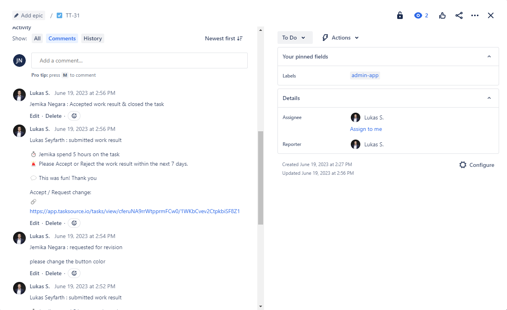


## Security

At our organization, we place the utmost importance on security and privacy. Our stringent security policy reflects our commitment to safeguarding your information and maintaining your trust. Below are some of the robust security measures we have implemented:


- We have designed our webhook endpoint to respond only to changes associated with the integrations@tasksource.io account. Any unrelated activity is unequivocally ignored. This rigid approach guarantees that our webhook endpoint cannot be exploited to extract data from your Jira instance, ensuring maximum data security.

- Recognizing that some clients may desire complete control over their webhook, we provide an on-premise bridge service that can be self-hosted. If this appeals to you, please reach out to us for more detailed information.

- With regards to media uploaded to Jira, we guarantee that none of it is stored on tasksource servers. Instead, we employ a secure blob forwarding mechanism that displays images, videos, and all other files directly from your Jira, without storing them in any external locations.

- Our protocols align strictly with the Jira security webhook guidelines, demonstrating our commitment to not only adhere to but also exceed industry standards.

By implementing these stringent security measures, we strive to provide a safe and secure environment for your data, ensuring peace of mind and a reliable experience.


### Links
More information: https://www.tasksource.ai/tasksource-blog/tasksource-io-jira-integration

Login: https://www.app.tasksource.io/login

Questions: info@tasksource.io
